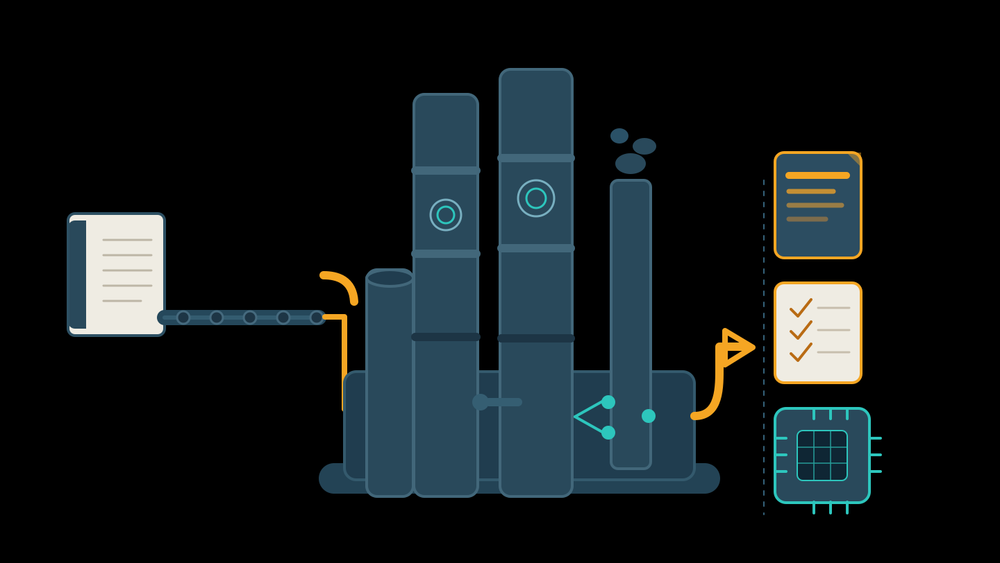

# Agent Knowledge Ops

Kit operacional para transformar fontes brutas em conhecimento refinado, método reutilizável e capacidades operacionais para agentes.



## Tese

Agentes melhores não precisam apenas de mais contexto. Eles precisam de conhecimento promovido com critério.

```text
source intake
-> library
-> distillation
-> promotion decision
-> knowledge / method / operation
-> agent product
```

## O Que Este Kit Faz

- organiza fontes grandes em projetos rastreáveis
- separa fonte bruta, biblioteca, destilação e promoção
- sintetiza evidências de múltiplas fontes antes de promover conhecimento
- transforma unidades de conhecimento em method-wiki, workflows, skills e templates
- cria e valida o scaffold de um agente-produto quando já houver desenho e fronteira suficientes
- mantém o agente-produto como `candidate` até existir uso real e avaliação

## Projeto De Fonte

Antes de destilar uma fonte grande, crie um projeto de fonte:

```text
project/
  README.md
  source-manifest.md
  promotion-matrix.md
  raw/
  library/
  distillations/
  promotions/
  method-wiki/
  operations/
  agent-product/
```

Templates disponíveis:

- `youtube`: canal ou playlist, unidade principal `vídeo`
- `book`: livro, unidade principal `capítulo`
- `earnings-calls`: resultados de empresas abertas, unidade principal `empresa + trimestre`

Para coleções de livros no padrão `books/<tema>/`, use `book-collection-setup`: ele cria o README editorial e o índice por capítulo usados para decidir o que deve ser destilado e promovido.

Quando um livro deve alimentar um `_method-wiki` existente, use `book-to-method-wiki`: ele força destino antes da leitura, preferência por enriquecer arquivos existentes e atualização do índice após a sessão.

## Estrutura

- `AGENTS.md`: instruções canônicas para agentes trabalhando neste repositório
- `CLAUDE.md`: redirecionamento para `AGENTS.md`
- `ARCHITECTURE.md`: arquitetura do kit
- `FRAMEWORK.md`: ciclo completo da refinaria
- `ROADMAP.md`: direção futura
- `frameworks/`: modelos conceituais e critérios de decisão
- `schemas/`: contratos de estrutura
- `templates/`: arquivos base reutilizáveis
- `skills/`: procedimentos executáveis por agentes
- `tools/`: scripts utilitários
- `examples/`: exemplos de destilação e uso

Peças recentes para síntese antes da promoção:

- `frameworks/knowledge-synthesis-framework.md`: deduplicação, conflitos, confiança e síntese multissource
- `frameworks/source-priority-framework.md`: prioridade de fontes por tipo de pergunta
- `schemas/evidence-bundle.schema.md`: contrato para agrupar evidências
- `templates/evidence-bundle.md`: template de pacote de evidência

Skills de apoio a intake e pesquisa:

- `source-project-setup`: cria a estrutura padrão de projeto de fonte
- `company-web-research`: transforma pesquisa web sobre empresas em contexto verificável antes da destilação
- `agent-product-scaffold`: cria a casa operacional de um agente-produto a partir de uma especificação

Para criar um agente-produto:

```bash
python3 tools/create-agent-product.py ../meu-agente \
  --product-name "Meu Agente" \
  --description "Papel e fronteira do agente." \
  --domain "Domínio do agente"
python3 tools/validate-agent-product.py ../meu-agente
```

Para uso operacional, comece por `AGENTS.md` e pelos scripts em `tools/`.

## Regra De Ouro

Fonte bruta não entra direto no agente.

Ela passa por biblioteca, destilação e decisão de promoção antes de virar conhecimento canônico, método ou operação.
