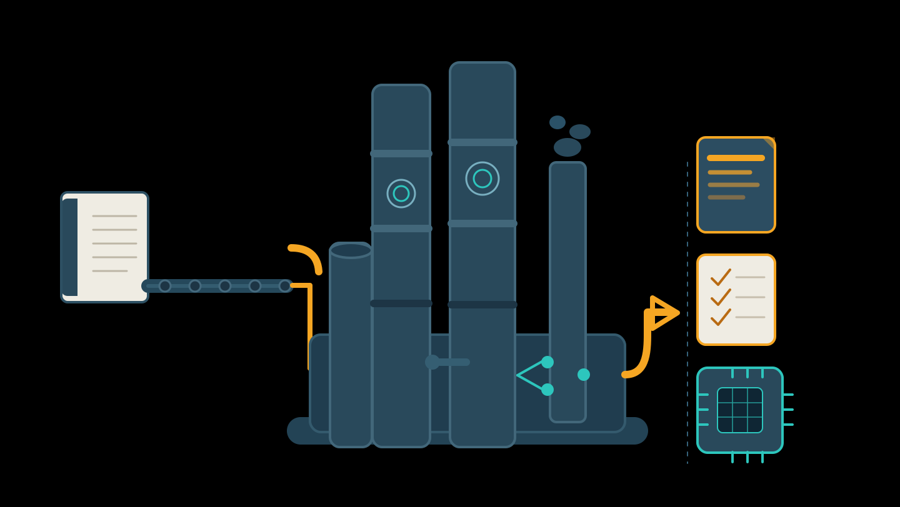

# Agent Knowledge Ops

An operational kit for turning raw sources into refined knowledge, reusable methods, and operational capabilities for agents.



## Thesis

Better agents do not need only more context. They need knowledge promoted with judgment.

```text
source intake
-> library
-> distillation
-> promotion decision
-> knowledge / method / operation
-> agent product
```

## What This Kit Does

- organizes large sources into traceable projects
- separates raw source, library, distillation, and promotion
- turns knowledge units into method-wikis, workflows, skills, and templates
- keeps agent product as a possible destination, not as the starting point

## Source Project

Before distilling a large source, create a source project:

```text
project/
  README.md
  source-manifest.md
  promotion-matrix.md
  raw/
  library/
  distillations/
  promotions/
  method-wiki/
  operations/
  agent-product/
```

Available templates:

- `youtube`: channel or playlist, main unit `video`
- `book`: book, main unit `chapter`
- `earnings-calls`: public company earnings materials, main unit `company + quarter`

For book collections in the `books/<topic>/` pattern, use `book-collection-setup`: it creates the editorial README and chapter index used to decide what should be distilled and promoted.

When a book should feed an existing `_method-wiki`, use `book-to-method-wiki`: it enforces destination before reading, prefers enriching existing files, and requires index updates after each session.

## Structure

- `AGENTS.md`: canonical instructions for agents working in this repository
- `CLAUDE.md`: redirect to `AGENTS.md`
- `ARCHITECTURE.md`: kit architecture
- `FRAMEWORK.md`: full refinery cycle
- `ROADMAP.md`: future direction
- `frameworks/`: conceptual models and decision criteria
- `schemas/`: structure contracts
- `templates/`: reusable base files
- `skills/`: executable procedures for agents
- `tools/`: utility scripts
- `examples/`: distillation and usage examples

For operational use, start with `AGENTS.md` and the scripts in `tools/`.

## Golden Rule

Raw source does not go directly into the agent.

It passes through library, distillation, and promotion decision before becoming canonical knowledge, method, or operation.
